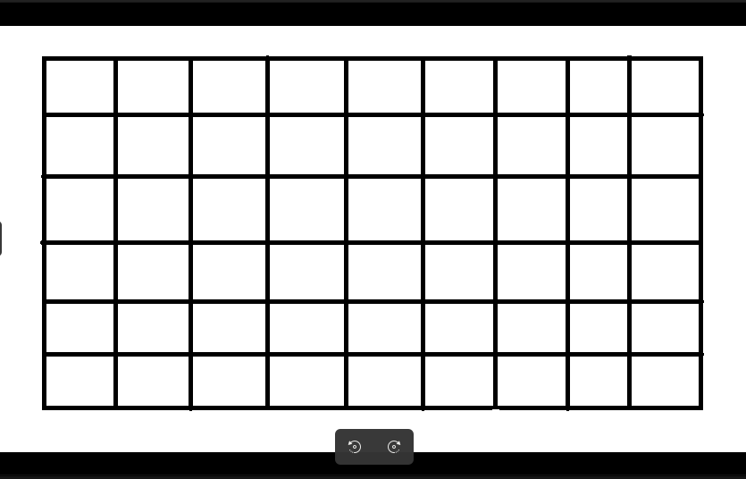
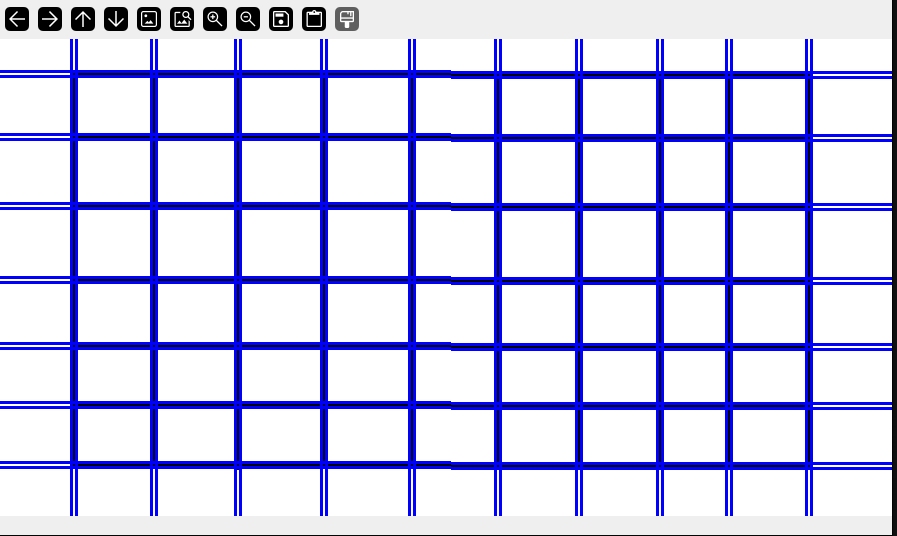
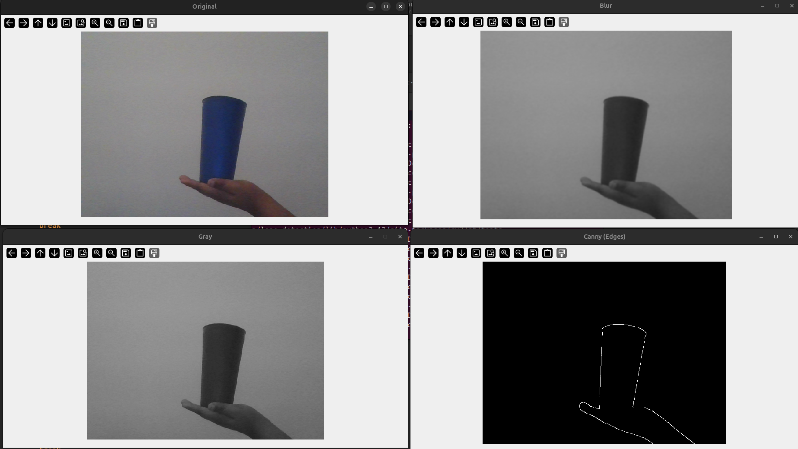
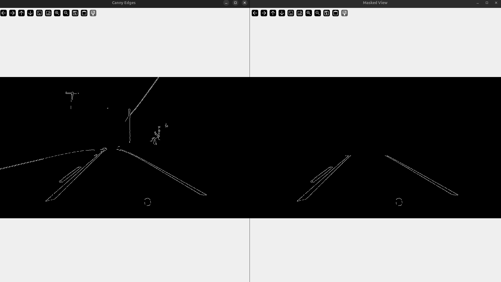
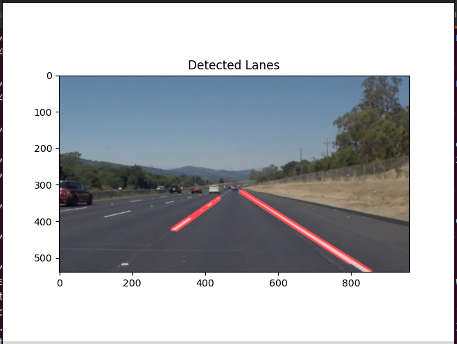
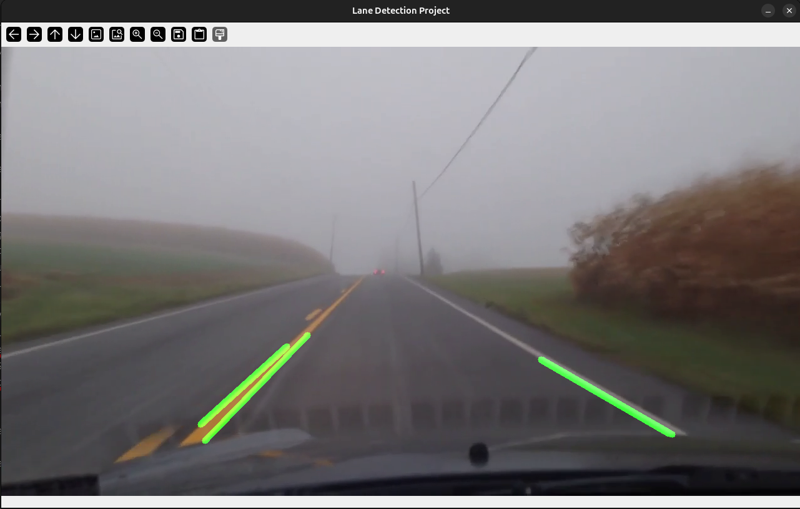

# Lane Detection for Autonomous Systems

This project demonstrates the complete development of a **computer vision-based lane detection pipeline** designed for autonomous driving systems and driver-assistance applications.

The implementation is divided into multiple development phases so that each stage explains an important concept used in real-world Advanced Driver Assistance Systems (ADAS).

---

# Installations

Main required packages:

```bash
pip install matplotlib
pip install opencv-contrib-python
```

Optional:

```bash
pip install numpy
```

---

# Repository Structure

- **codes/**  
  Contains all Python implementation files used throughout the project development phases, including Hough Transform logic, webcam processing, ROI masking, image-based lane detection, and real-time video lane detection.

- **files/**  
  Contains all required input files used by the scripts, including sample images (`calender.png`, `laneimg.jpeg`) and the driving video (`video.mp4`).

- **images/**  
  Contains screenshots and output images used inside the README documentation to visually demonstrate the results produced at each development phase.

- **README.md**  
  Project documentation file containing installation steps, implementation details, explanations of each development phase, and output demonstrations.

---

# Development Phases

### 1️⃣ Mathematical Logic (Hough Line Transform)
**Script:** `codes/hough_lines.py` | **Input:** `files/calender.png`

This phase serves as the "brain" of the project, moving beyond pixel-level analysis to recognize geometric structures.

*   **Grayscale Conversion:** Reduces the image from 3 color channels (RGB) to 1 (Brightness), simplifying math and reducing computational load.
*   **Canny Edge Detection:** Scans for sharp intensity gradients to create a white-on-black structural "skeleton."
*   **The Polar Coordinate Trick:** Uses the Hough space formula (ρ, θ) instead of y = mx + c. This prevents mathematical instability when dealing with vertical lines (where slope m would be infinite).
*   **The Voting System:** Every edge pixel "votes" for all possible lines passing through it. A line is only rendered if it exceeds a specific **threshold** (e.g., 300 votes).
*   **Drawing Logic:** Trigonometric functions (cos and sin) convert (ρ, θ)$ back into (x, y) coordinates for visualization.

> **Output Demonstration:**
> 
> 

---

### 2️⃣ Live Feed & Pre-Processing
**Script:** `codes/webcam_input.py` | **Input:** Live Camera Feed

This stage establishes the "Eyes" of the system and introduces the crucial "cleanup" phase required for real-world sensor data.

*   **Hardware Interface:** Uses `cv2.VideoCapture` to grab frames in real-time from a webcam or external camera.
*   **Gaussian Noise Reduction:** Applies a 7 X 7 Gaussian kernel to soften digital grain. This prevents the Canny algorithm from mistaking camera noise for road edges, resulting in a much more stable detection.
*   **Adjustable Display:** Uses `WINDOW_NORMAL` flags for side-by-side comparison of filters (Original, Gray, Blur, Canny) during debugging.
*   **Safe Resource Release:** Implements logic to detect window closure and the `q` key to release camera hardware back to the OS properly.

> **Output Demonstration:**
> 

---

### 3️⃣ Region of Interest (ROI) & Masking Logic
**Script:** `codes/roi_marking.py` | **Input:** `files/video.mp4`

This phase acts as a spatial filter, focusing the computer's "attention" on the road surface while ignoring irrelevant environmental data.

*   **Spatial Filtering:** Mathematically ignores the sky, trees, and buildings to prevent "false positive" line detections from high-contrast objects outside the road.
*   **The Masking Process:** 
    1.  Create a **Black Canvas** (`np.zeros_like`) representing the image dimensions.
    2.  Define a **Trapezoidal Polygon** that mimics the perspective of a road converging at the horizon.
    3.  **Bitwise AND Operation:** Merges the Canny edge image with the mask. Only pixels that are "White" in both images are preserved.
*   **Performance Optimization:** By removing 60–70% of the image data, the subsequent line detection math runs significantly faster.

> **Output Demonstration:**

> 

---

### 4️⃣ Lane Detection on Image
**Script:** `codes/lane_detector_img.py` | **Input:** `files/laneimg.jpeg`

Consolidating all concepts into a unified pipeline to detect and highlight lanes on a static image.

*   **Probabilistic Hough Transform (`HoughLinesP`):** An optimized version of the Hough Transform that returns specific line segments (x1, y1) -> (x2, y2) rather than infinite lines.
*   **Logic Tuning:**
    *   **Min Line Length:** Ignores small, noisy detections like cracks in the pavement or road debris.
    *   **Max Line Gap:** Connects dashed lane markings into a single, continuous line by bridging small gaps.
*   **Visualization (AddWeighted):** Blends the detected lines with the original image using the formula: Result = (Image X α ) + (Lines X β) + γ. This creates a professional semi-transparent HUD overlay.

> **Output Demonstration:**
> 

---

### 5️⃣ Lane Detection on Video (Real-Time)
**Script:** `codes/lane_detector.py` | **Input:** `files/video.mp4`

The culmination of the project: a robust, object-oriented pipeline capable of processing moving driving footage at high frame rates.

*   **Modular Design:** The entire process is encapsulated in a `process_frame()` function, making the code scalable and easier to integrate into larger autonomous systems.
*   **Dynamic ROI:** Uses image `height` and `width` variables instead of fixed pixels, making the script resolution-independent (works on 720p, 1080p, or 4K videos).
*   **Augmented Reality Overlay:** 
    *   **Green for "Go":** Uses `(0, 255, 0)` for high-visibility lane tracking.
    *   **Real-time Stability:** Optimized `maxLineGap` ensures dashed lanes remain tracked smoothly throughout the video duration.
*   **Safety Checks:** Includes `cap.isOpened()` to verify file integrity and `if __name__ == "__main__":` to follow Python development best practices.

> **Output Demonstration:**
> 

---

# Summary of Pipeline Logic

1. Capture raw frames
2. Convert to grayscale
3. Apply Gaussian Blur
4. Detect edges using Canny
5. Apply Region of Interest mask
6. Detect lane lines using Hough Transform
7. Overlay lanes onto original frames
8. Display real-time results

---

# Technologies Used

- Python
- OpenCV
- NumPy
- Matplotlib
- Computer Vision
- Image Processing

---

# Applications

- Autonomous Vehicles
- Driver Assistance Systems (ADAS)
- Self-Driving Research
- Robotics Navigation
- Smart Transportation Systems


**Note:** The final processed video output can be found in the `files/` folder.
